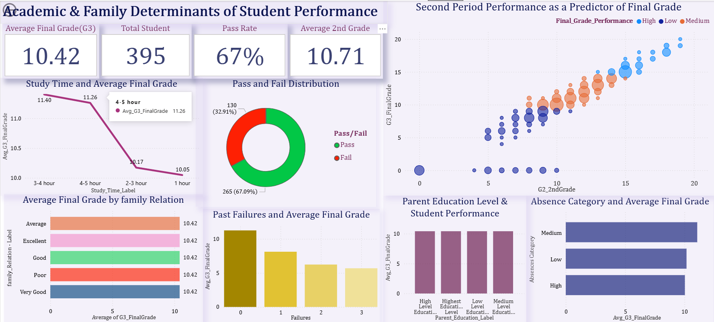
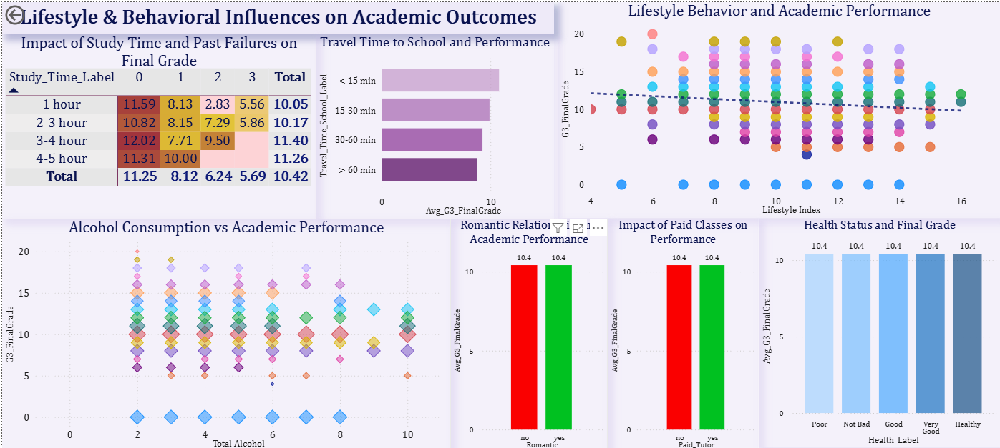

# Student Performance Analytics Dashboard

> An interactive Power BI project focused on understanding how academic history, family context, and lifestyle patterns relate to student final grades.

## Overview

This project analyzes the UCI Student Performance dataset to identify the strongest factors associated with academic outcomes among 395 students from two Portuguese secondary schools. The final deliverable is a two-page Power BI dashboard designed for interactive exploration of grade patterns, student behavior, and family-related influences.

The workflow began with source data review in Excel, followed by normalization into Third Normal Form (3NF), transformation in Power Query, and dashboard development in Power BI using DAX measures and derived reporting features. Rather than treating the dataset as a single flat table, the project was structured to support cleaner modeling, better relationships, and more flexible analysis.

## Project Scope

The analysis focuses on final grade (`G3`) as the main outcome variable and compares academic, demographic, family, and lifestyle-related factors. The original dataset contains 33 variables, which were reorganized into five related tables: Students, Demographics, Family, Lifestyle, and Support.

To improve reporting and interpretation, the project introduced several derived features, including Pass/Fail, Performance Category, Lifestyle Index, Total Alcohol Consumption, and Parent Education Groups. Key dashboard measures include Average Final Grade (G3), Average Second Grade (G2), Total Students, and Pass Rate.

## Dashboard Design

The final solution is organized into two report pages. The first page, **Academic and Family Determinants**, highlights the relationship between final grades and variables such as prior grades, failures, study time, parent education, family relationship quality, absences, and pass/fail distribution. The second page, **Lifestyle and Behavioral Influences**, explores factors such as lifestyle index, alcohol consumption, paid tutoring, romantic relationships, travel time, health, and broader behavioral patterns.

This design was intended to separate performance drivers into two distinct analytical perspectives so users could move from academic predictors to lifestyle influences without cluttering the dashboard experience.

## Findings

The analysis showed that second-period grade (`G2`) was the strongest predictor of final academic performance, making prior academic history the clearest signal of student success. Past failures also showed a strong negative relationship with final grade, while study time demonstrated a more moderate influence on outcomes.

In contrast, lifestyle and family-related factors appeared to have weaker overall effects when compared with academic history. This suggests that student performance is more strongly explained by existing academic trajectory than by most behavioral or household variables in the dataset.

## Technical Highlights

This project demonstrates practical business intelligence skills in data preparation, modeling, and reporting. It includes relational restructuring of the source data, Power Query transformation workflows, DAX-based KPI development, interactive dashboard design, and insight communication through visual storytelling.

It also shows an understanding of how to turn an academic dataset into a structured reporting solution that is easier to navigate, interpret, and present professionally.

## Dashboard Previews

  
This dashboard highlights the academic and family-related factors associated with student performance. It includes KPIs, grade comparisons, pass/fail distribution, and visual relationships that help explain how prior academic results and school-related variables influence final outcomes.   

This dashboard focuses on lifestyle and behavioral influences on student performance. It presents study habits, travel time, alcohol use, tutoring, relationships, and health-related indicators in an interactive format designed to make patterns easy to compare and interpret.  
